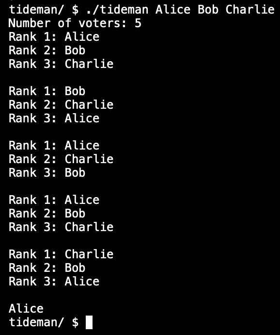

# Tideman

## Overview
Implements the Tideman ranked-choice voting algorithm, determining a winner based on head-to-head candidate matchup preferences while avoiding cycles in a directed graph.

## Features
- Records voter rankings and translates them into a pairwise preference matrix.
- Creates pairs of candidate matchups and sorts them by strength of victory.
- Locks pairs into a directed graph while preventing cycles.
- Handles edge cases such as ties, circular preferences, and invalid votes.

## Functionality & Approach
- **Collect rankings:**  
  For each voter, the rank of every candidate is stored in a `ranks` array.

- **Record preferences:**  
  The `ranks` array is use to update a 2D `preferences` array to count which candidate is preferred over others.

- **Form and manage pairs:**  
  - Store candidate pairs in an array of a custom `pair` struct (`winner`, `loser`).  
  - Ensure no duplicate pairs are added.

- **Sort pairs:**  
  - Compute the strength of each victory.  
  - Sort both the strength array and the pairs array in descending order.

- **Lock pairs without cycles:**  
  - Iteratively lock pairs.  
  - Use a combination of iteration and recursion to detect and prevent cycles.

- **Determine winner:**  
  Print the candidate with no incoming edges in the locked graph.

## Example Usage
```bash
make tideman
./tideman Alice Bob Charlie
```


## What I Learned
- How to track and pass information across multiple arrays for different purposes.
- Debugging techniques using print statements and small input/output sketches.
- Implementing recursion in C.
- Effective use of structs to organize related data.
- Translating algorithmic logic into working, constraint-compliant code.

## How to Run
### Option 1: CS50 Codespaces (recommended)
This program is designed to run in the CS50 development environment.
```bash
make tideman
./tideman Alice Bob Charlie
```
### Option 2: Local Compilation
Local compilation requires manually installing and linking the CS50 library.